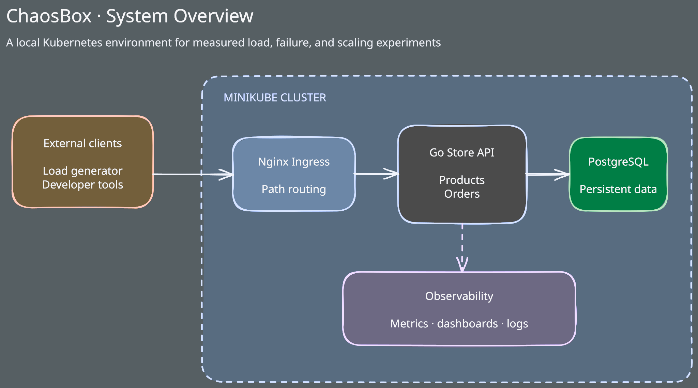

# ChaosBox

A local Kubernetes playground for simulating production conditions such as resource limits, traffic spikes, network latency, regional delays, and service failures.

ChaosBox explores how a deliberately simple system can evolve toward large workloads. Rather than simulating a billion concurrent users locally, each phase introduces production-shaped traffic and failures, identifies the next measurable constraint, and tests a targeted improvement.

See [Project Phases](PHASES.md) for the goals, API behavior, test criteria, and resource limits of each phase.

## Getting Started

Run all commands from the repository root. Local development requires Go 1.27.1 or later, Docker with Docker Compose, `make`, and `curl`.

```sh
make dev
```

This starts PostgreSQL, waits for it to become healthy, and runs the API at `http://localhost:8080`. Verify it from another terminal with `make smoke`.

Stop the API with `Ctrl+C`, then stop PostgreSQL with `make db-down`. Run `make help` for all database, Minikube, load-testing, and verification commands.

### Minikube

Minikube workflows additionally require `minikube` and `kubectl`:

```sh
make minikube-start
make minikube-build
make minikube-deploy
make minikube-tunnel
```

Keep the tunnel running, then use `make minikube-url` to print the Nginx gateway URLs. Run `make load-smoke` or `make load-test` from another terminal. See the [Phase 1 details](PHASES.md#phase-1) for the architecture, observability baseline, and test requirements, or the [Minikube deployment guide](deploy/minikube/README.md) for operational commands.

## Current Architecture



The Phase 1 system uses one Nginx Ingress endpoint for the store and observability tools. See [Phase 1 architecture](PHASES.md#architecture) for the request, metrics, logging, and persistence paths.

## Current Status

Phase 1 testing is in progress. The Go API, PostgreSQL migrations and seed data, structured request logging, Prometheus instrumentation, Grafana dashboards, Loki log collection, container images, Minikube manifests, automated tests, load generator, Bruno flow, and CI pipeline are implemented.

See [Phase 1 details](PHASES.md#phase-1) for the full status and testing requirements.
