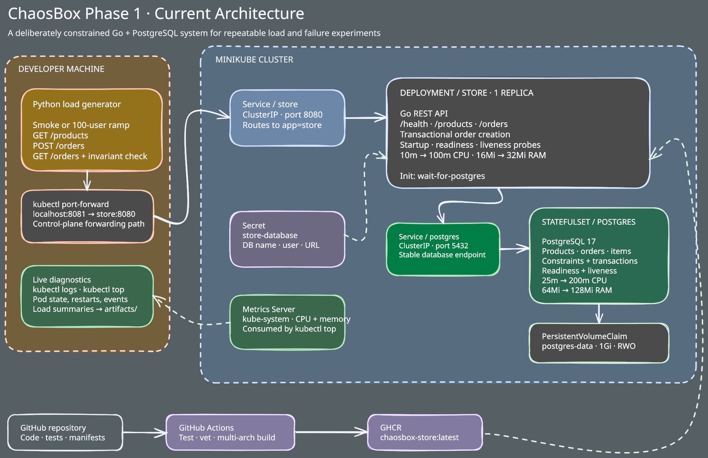

# ChaosBox

A local Kubernetes playground for simulating production conditions such as resource limits, traffic spikes, network latency, regional delays, and service failures.

ChaosBox explores how a deliberately simple system can evolve toward large workloads. Rather than simulating a billion concurrent users locally, each phase introduces production-shaped traffic and failures, identifies the next measurable constraint, and tests a targeted improvement.

See [Project Phases](PHASES.md) for the goals, API behavior, test criteria, and resource limits of each phase.

## Getting Started

Run all commands from the repository root. Local development requires Go 1.27.1 or later, Docker with Docker Compose, `make`, and `curl`.

```sh
make dev
```

This starts PostgreSQL, waits for it to become healthy, and runs the API at `http://localhost:8080`. Verify it from another terminal with `make smoke`.

Stop the API with `Ctrl+C`, then stop PostgreSQL with `make db-down`. Run `make help` for all database, Minikube, load-testing, and verification commands.

### Minikube

Minikube workflows additionally require `minikube` and `kubectl`:

```sh
make minikube-start
make minikube-build
make minikube-deploy
make minikube-forward
```

The forwarded API is available at `http://localhost:8081`. In another terminal, run `make load-smoke` or `make load-test`. Use `make minikube-clean` to remove workloads and data, and `make minikube-stop` to stop the cluster.

## Current Architecture



The load generator runs outside Minikube and reaches the store through `kubectl port-forward`. Inside the `chaosbox` namespace, a ClusterIP Service routes requests to one constrained Go API replica, which uses PostgreSQL through its own stable Service. PostgreSQL data survives pod replacement through a `1Gi` persistent volume claim.

## Current Status

Phase 1 testing is in progress. The Go API, PostgreSQL migrations and seed data, container images, Minikube manifests, automated tests, load generator, Bruno flow, and CI pipeline are implemented.

See [Phase 1 details](PHASES.md#phase-1) for the full status and testing requirements.
